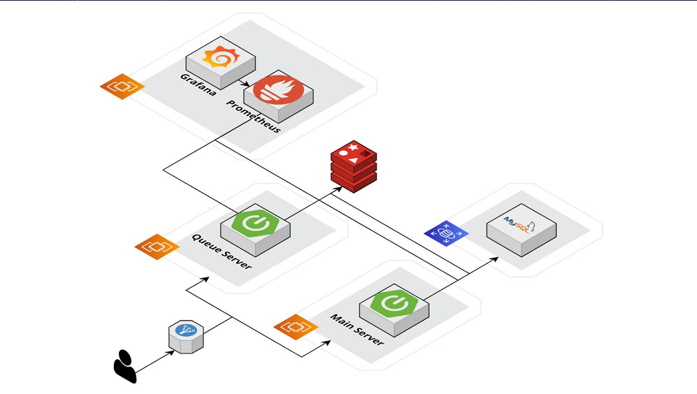

# 🎫 축제의 민족

## 📌 프로젝트 개요

이 프로젝트는 제한된 리소스 환경(AWS t3.small EC2 인스턴스 2대, RDS, Redis)에서 안정적인 운영을 목표로 하는 고성능 페스티벌 티켓 예매 시스템입니다. 순간적인 대규모 트래픽 상황에서도
안정적으로 동작하도록 설계되었으며, 효율적인 대기열 관리와 비동기 처리를 통해 사용자 경험을 최적화합니다.

### 프로젝트 목표

- 서버 안정성 확보: CPU 사용률 피크 시 80% 이하 유지
- 사용자 경험 최적화: 평균 응답 시간 5초 이내 유지 (티켓 조회부터 결제까지)

## 🚀 핵심 기능

1. **실시간 대기열 시스템**: Redis 기반의 공정한 대기열 관리
2. **효율적인 결제 처리**: 비동기 방식의 결제 처리 및 주기적 상태 조회
3. **실시간 티켓 점유 및 결제 기회 보장**: Redis 기반 티켓 재고 점유 시스템
4. **비동기 주문 처리**: 인메모리 큐 시스템을 통한 주문 처리 최적화

## 👀 데모
### 메인 화면

### 마이 페이지

### 구매 페이지

### 어드민 페이지

### 체크인

## 🛠 기술 스택

  
  
  
  
  
  
  
  

## 📐 아키텍처

## 🔧 핵심 컴포넌트

### 1. 대기열 시스템 (WaitOrderService)

- 원리: 청크 기반의 대기열 관리 시스템
- 대기열 관리:
   - Redis Set을 사용하여 각 티켓에 대한 대기열 유지
   - 사용자 진입 시 현재 대기열의 크기를 기반으로 대기 순서 할당
- 입장 관리:
   - passChunkSize 단위로 입장 가능한 범위 관리
   - 주기적으로 입장 가능 범위를 passChunkSize만큼 증가시켜 순차적 입장 허용
- 상태 확인 및 업데이트:
   - 사용자의 대기 순서가 현재 입장 가능 범위 내에 있는지 확인
   - 재고 여부도 함께 체크하여 입장 가능 여부와 남은 대기 인원 수 제공

### 2. 결제 시스템 (PurchaseFacadeService, PaymentService)

- 원리: 비동기 결제 처리 및 상태 관리
- 결제 프로세스:
   - 결제 요청 시 UUID 기반의 결제 ID 생성 후 비동기로 결제 처리 시작
   - CompletableFuture를 사용하여 비동기 결제 처리 구현
- 상태 관리:
   - Caffeine 캐시를 사용하여 결제 상태 관리
   - 결제 ID를 키로 사용하여 결제 정보 및 상태 저장
- 결제 완료 후 처리:
   - 결제 성공 시 QueueService를 통해 구매 정보 처리
   - 결제 실패 시 CompensationService를 통해 재고 및 상태 롤백

### 3. 재고 관리 (TicketStockCountRedisRepository)

- 원리: Redis를 활용한 실시간 재고 관리
- 재고 관리:
   - Redis에 각 티켓의 재고 수량 저장
   - 원자적 감소 연산을 사용하여 동시성 문제 해결
- 재고 동기화:
   - TicketScheduleService를 통해 판매 전에 Redis의 재고 정보 업데이트

### 4. 주문 처리 (QueueService)

- 원리: 인메모리 큐를 활용한 비동기 주문 처리
- 주문 접수:
   - InMemoryQueue에 구매 데이터(PurchaseData) 저장
   - 큐가 가득 찼을 경우 지수 백오프를 적용한 재시도 로직 구현
- 주문 처리:
   - 주기적으로(5초마다) 큐에서 배치 단위로 주문 데이터 처리
   - 배치 크기는 큐의 현재 크기에 따라 동적으로 조정
- 데이터 일관성:
   - 주문 정보와 체크인 정보를 트랜잭션으로 묶어 일괄 처리
   - JDBC batch update를 사용하여 데이터베이스 연산 최적화
- 장애 복구:
   - 서버 재시작 시 로그 파일을 분석하여 미처리된 주문 복구
   - 처리 실패한 주문에 대한 재시도 메커니즘 구현

## 📈 성능 최적화 전략

1. **인메모리 캐싱**
   - Caffeine 캐시를 이용한 애플리케이션 레벨 캐싱
     - 응답 시간 29% 단축

2. **데이터베이스 최적화**
   - Skip Lock 을 이용한 동시성 제어 (`SELECT ... FOR UPDATE SKIP LOCKED`)
     - 응답 시간 68% 단축 [Wiki](https://github.com/woowa-techcamp-2024/Team2-Dari/wiki/2%EC%B0%A8%3A-Skip-Locked-%EA%B8%B0%EB%B0%98-%EB%9D%BD-%EB%B3%91%EB%AA%A9-%ED%95%B4%EA%B2%B0)

3. **비동기 및 배치 처리**
   - CompletableFuture를 이용한 비동기 결제 처리
   - 주문 처리를 위한 커스텀 인메모리 큐 구현
   - JDBC 배치 업데이트를 통한 벌크 연산 효율화
   - RPS 23% 향상 [Wiki](https://github.com/woowa-techcamp-2024/Team2-Dari/wiki/3%EC%B0%A8%3A-%EA%B2%B0%EC%A0%9C-%EB%B9%84%EB%8F%99%EA%B8%B0-%EC%B2%98%EB%A6%AC-%EB%B0%8F-%EA%B2%B0%EC%A0%9C-%ED%9B%84%EC%86%8D-%EC%9E%91%EC%97%85-%EB%B0%B0%EC%B9%98-%EC%B2%98%EB%A6%AC-%EA%B8%B0%EB%B0%98-DB-%EC%BB%A4%EB%84%A5%EC%85%98-%EA%B0%90%EC%86%8C)
     
4. **대기열 시스템 설계**
   - 티켓팅 시 서비스 가용성 확보를 위한 대기열 시스템 도입
   - 5000명 동시 접속자에도 메인 서버 CPU 사용률 50% 이하로 안정성 확보 [Wiki](https://github.com/woowa-techcamp-2024/Team2-Dari/wiki/4%EC%B0%A8%3A-%EB%8C%80%EA%B8%B0%EC%97%B4-%EC%8B%9C%EC%8A%A4%ED%85%9C-%EA%B8%B0%EB%B0%98-%EA%B0%80%EC%9A%A9%EC%84%B1-%ED%99%95%EB%B3%B4)

5. **시스템 안정성 및 복구 전략**
   - 지수 백오프를 활용한 재시도 로직 구현
   - 장애 상황 대비 복구 메커니즘 구현 (로그 기반 복구)

## 👥 팀 소개

저희는 **팀 twoDari**입니다. 사용자와 축제를 이어주는 다리 역할을 합니다.

| 이름  | 역할  | 주요 기여                                | GitHub                                           |
|-----|-----|--------------------------------------|--------------------------------------------------|
| 김현종 | 백엔드 | MySQL비동기 처리, 배치 처리, 프론트엔드 화면 구성      | [@bellringstar](https://github.com/bellringstar) |
| 김규원 | 백엔드 | 캐싱전략, Redis를 사용한 대기열, 프론트엔드 화면 구성    | [@kkyu0718](https://github.com/kkyu0718)         |
| 김현준 | 백엔드 | devops, 스케쥴링 작업, 다양한 모듈 간 연계 및 성능 개선 | [@HyeonJun0530](https://github.com/HyeonJun0530) |
| 박민지 | 백엔드 | Redis를 사용한 대기열 로직, 프로젝트 모듈화          | [@minnim1010](https://github.com/minnim1010)     |
