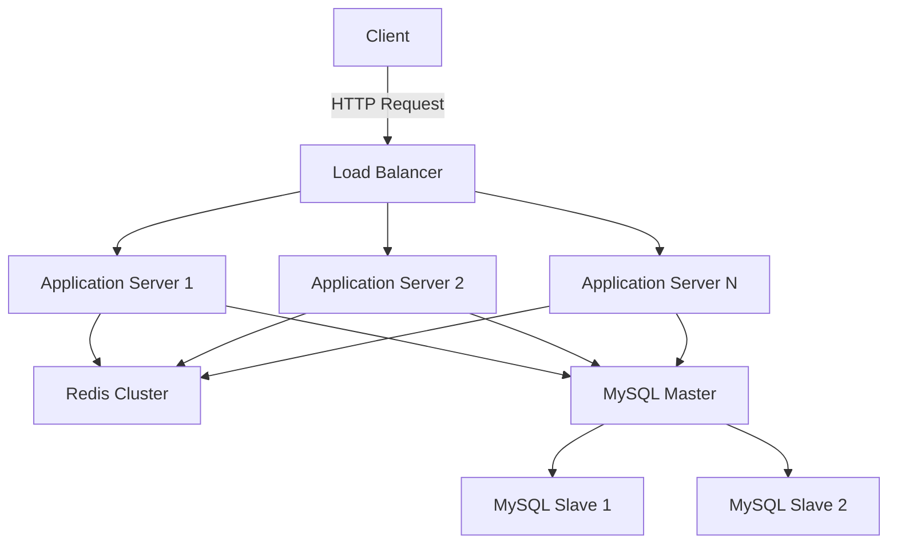

# 🎉 축제의 민족

<p align="center">
  
</p>

<p align="center">
  <strong>고성능 선착순 티켓팅 시스템</strong><br>
  순간적 고부하에서도 안정적인 축제 티켓 구매 경험을 제공합니다
</p>

<p align="center">
  <a href="#-서비스-소개">프로젝트 소개</a> •
  <a href="#-주요-목표">주요 목표</a> •
  <a href="#-핵심-기능">핵심 기능</a> •
  <a href="#-기술-스택">기술 스택</a> •
  <a href="#-시스템-아키텍처">시스템 아키텍처</a> •
  <a href="#-성능-최적화">성능 최적화</a> •
  <a href="#-팀-소개">팀 소개</a> •
  <a href="#-성능-테스트-결과">성능 테스트 결과</a> •
  <a href="#-설치-및-실행">설치 및 실행</a> •
</p>

## 🌟 서비스 소개

**축제의 민족**은 대규모 동시 접속과 순간적인 트래픽 급증 상황에서도 안정적으로 동작하는 고성능 선착순 티켓팅 시스템입니다. 사용자들에게 공정하고 빠른 티켓 구매 경험을 제공하며, 서버의 과부하를 효과적으로
관리합니다.

### 주요 목표

- 🚀 **고성능**: 초당 1,000건 이상의 동시 요청 처리
- ⚖️ **공정성**: 선착순 원칙을 지키면서 모든 사용자에게 동등한 기회 제공
- 💪 **안정성**: 급격한 트래픽 증가에도 시스템 다운 없이 안정적 운영
- 🔒 **신뢰성**: 중복 구매 방지 및 정확한 재고 관리

## 🚀 핵심 기능

1. **고성능 선착순 티켓팅**
    - 분산 락을 이용한 동시성 제어
    - Redis 기반의 고속 대기열 시스템

2. **실시간 재고 관리**
    - In-memory 데이터 구조를 활용한 초고속 재고 확인
    - 낙관적 락을 통한 데이터 정합성 보장

3. **대용량 트래픽 핸들링**
    - 비동기 처리를 통한 응답 시간 최소화
    - 작업 큐를 활용한 요청 버퍼링

4. **신뢰성 있는 결제 처리**
    - 트랜잭션 관리를 통한 안전한 결제 프로세스
    - 멱등성 보장을 위한 유니크 토큰 시스템

## 🛠 기술 스택

<p align="center">
  
  
  
  
  
  
  
</p>

## 📐 시스템 아키텍처

우리의 시스템은 다중 계층 아키텍처를 채택하여 높은 확장성과 가용성을 보장합니다:

1. **로드 밸런서**: 들어오는 요청을 여러 애플리케이션 서버에 분산
2. **애플리케이션 서버**: 비즈니스 로직 처리 및 데이터 접근 조정
3. **Redis**: 고속 데이터 처리, 캐싱 및 대기열을 위한 인메모리 데이터 스토어
4. **MySQL**: 영구 데이터 저장을 위한 관계형 데이터베이스



## 🔧 성능 최적화

1. **대기열 시스템**
    - Redis Sorted Set을 활용한 효율적인 대기열 관리
    - 대기 순서에 따른 공정한 티켓 분배

2. **캐싱 전략**
    - 다층 캐싱 구조를 통한 데이터베이스 부하 감소
    - 캐시 일관성을 위한 Write-Through 및 Write-Back 전략 혼용

3. **비동기 처리**
    - 결제 처리 등 시간이 걸리는 작업의 비동기적 수행
    - 이벤트 기반 아키텍처를 통한 시스템 반응성 향상

4. **데이터베이스 최적화**
    - 인덱스 튜닝 및 쿼리 최적화

## 👥 팀 소개

저희는 **팀 twoDari**입니다. 사용자와 축제를 이어주는 다리 역할을 합니다.

| 이름  | 역할  | 주요 기여 | GitHub                                           |
|-----|-----|-------|--------------------------------------------------|
| 김규원 | 백엔드 | 백엔드에요 | [@kkyu0718](https://github.com/kkyu0718)         |
| 김현종 | 백엔드 | 백엔드에요 | [@bellringstar](https://github.com/bellringstar) |
| 김현준 | 백엔드 | 백엔드에요 | [@HyeonJun0530](https://github.com/HyeonJun0530) |
| 박민지 | 백엔드 | 백엔드에요 | [@minnim1010](https://github.com/minnim1010)     |

## 📊 성능 테스트 결과

최근 진행한 부하 테스트에서 다음과 같은 결과를 얻었습니다:

동시 사용자 수: 10,000
초당 처리 요청 수: 1,500 TPS
평균 응답 시간: 200ms
99.9% 백분위 응답 시간: 800ms

자세한 테스트 방법론과 결과는 성능 테스트 보고서를 참조하세요.

## 📥 설치 및 실행

```bash
# 레포지토리 클론
git clone https://github.com/your-repo/festival-of-people.git

# 디렉토리 이동
cd festival-of-people

# Docker 컨테이너 실행
docker-compose up -d

# 애플리케이션 빌드
./gradlew build

# 애플리케이션 실행
java -jar build/libs/festival-of-people-0.0.1-SNAPSHOT.jar